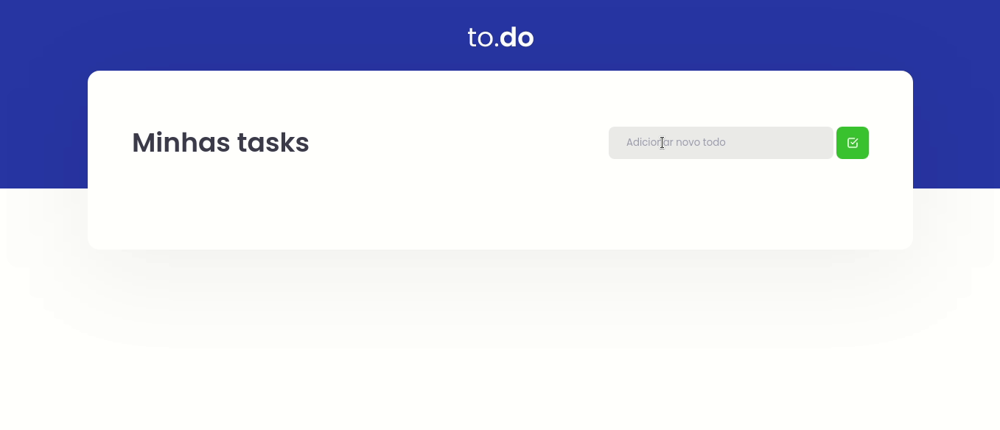

<h1 align="center">Task List</h1>



<p align="justify">Um app de lista de tarefas.</p>

### 💻 Funcionalidades
- [x] O usuário pode adicionar uma tarefa.
- [x] O usuário pode marcar a tarefa como ***checked***.
- [x] O usuário pode remover a tarefa.

### :nut_and_bolt: Tecnologias

Esse projeto foi desenvolvido com as seguintes tecnologias:

- [Javascript][javascript]
- [TypeScript][typescript]
- [React][reactjs]
- [Webpack][webpack]
- [Babel][babel]
- [SASS][sass]
- [Yarn][yarn]

[javascript]: https://developer.mozilla.org/pt-BR/docs/Web/JavaScript
[typescript]: https://www.typescriptlang.org/
[reactjs]: https://reactjs.org
[webpack]: https://webpack.js.org/
[babel]: https://babeljs.io/
[sass]: https://sass-lang.com/
[yarn]: https://yarnpkg.com/

### 🤔 Como rodar o projeto? 

```bash
# Clone o repositório
git clone https://github.com/Gabriek0/task-list

# Mude para o diretório do projeto
cd task-list

# Instale as dependências
yarn

# Rode o projeto
yarn dev
```

### 🧑 Autor do Projeto

<table>
  <tr>
    <td align="center">
      <a href="https://github.com/Gabriek0">
        
        <br />
          <sub>
            <b>Gabriel Henrique</b>
          </sub>
      </a>
    </td>

  </tr>
</table>


